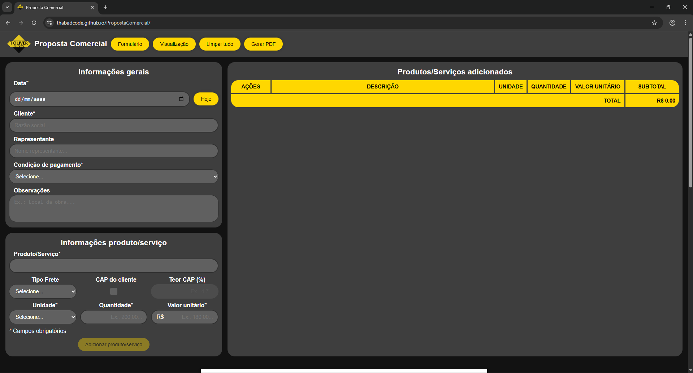

# 📄 Proposta Comercial Web
> Refatoração de planilhas de Excel para uma aplicação web focada em experiência do usuário (UX) e precisão de dados.

## 💡 Objetivo
Esta aplicação substitui planilhas de Excel complexas por uma interface web fluida, eliminando erros de preenchimento e agilizando a geração de documentos PDF profissionais.

## 🚀 Situação do projeto
✅ Versão 1.0 Finalizada / 🚀 Em constante evolução para novas features.

## ✨ Funcionalidades
- Inserção de dados de forma dinâmica a mediada que são digitadas.
- Sugestão de produtos.
- Listagem de itens a serem comercializados podendo remover e reordenar.
- Montagem dinâmica de descrição dos produtos.
- Validação de dados para mitigar erros.
- Geração de PDF personalizado para a empresa com a proposta comercial.
- Pré-visualização do PDF a ser gerado.
- Limpeza de campos e da lista de itens.

## 🛠️ Tecnologias Utilizadas
**Frontend:** HTML5, CSS3, JavaScript
**Ferramentas:** WebStorm e Firefox Dev Tools

## 🧠 Apoio no Desenvolvimento
Durante o ciclo de desenvolvimento, utilizei o **Google Gemini** (via navegador) como consultor técnico para:
- **Code Review:** Validação de sintaxe e boas práticas em JavaScript puro.
- **Análise de Casos:** Identificação de *edge cases* e tratamento de erros.
- **Arquitetura:** Discussão de ideias para implementação de funcionalidades e melhorias de UX.

## ▶️ Como utilizar
- Acesse o link: https://thabadcode.github.io/PropostaComercial/
- Informe os dados gerais obrigatórios
- Adicione ao menos 1 item
- Clique em 'Gerar PDF' ou CTRL+P
- Selecione 'Salvar como PDF' e selecione o local para salvar seu arquivo
- Ele será salvo como "Proposta Comercial - Razão Social do Cliente"

## Screenshoot do formulário do projeto

## ⚖️ Licença e Créditos

Este projeto foi desenvolvido utilizando as seguintes fontes e recursos:

- **Ícones:** [Lucide Icons](https://lucide.dev/) (Licença ISC).
- **Tipografia:** Fonte [Poppins](https://fonts.google.com/specimen/Poppins) via Google Fonts (Licença Open Font).
- **Desenvolvimento:** Construído utilizando a IDE [WebStorm](https://www.jetbrains.com/webstorm/) sob licença de uso não comercial.

---
Desenvolvido por [Marcos Aurélio / thabadcode]